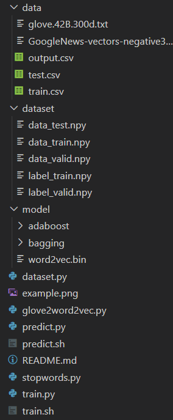

# README

> 2017013632 石大川
> 
> Mailto sdc17@mails.tsinghua.edu.cn
> 
> Kaggle UserName: sdcveg
> 
> Kaggle DisplayName: sdc17
> 
> Rank 15/55 for 30% Test 
> 
> Rank 12/70 for Final Test 

### 实验环境

Ubuntu 18.04

依赖方面没单独开虚拟环境，用到的包在常规的```pip/conda```源应该都能下载到。

### 用法

* 在根目录下创建```data/```文件夹，并将```train.csv```和```test.csv```放在该文件夹下

* 在根目录下创建```model/```文件夹，用于存放生成的```Word2Vec```模型和分类器模型

* 运行以下命令做特征抽取并训练```Word2Vec```模型：
    ```python
    python dataset.py
    ```
    
* 运行以下命令分别得到四种组合的分类器模型：
    ```
    python train.py --backbone=svm --ensemble=bagging --hyper=1024
    python train.py --backbone=svm --ensemble=adaboost --hyper=1024
    python train.py --backbone=dtree --ensemble=bagging --hyper=1024
    python train.py --backbone=dtree --ensemble=adaboost --hyper=1024
    ```
    
    其中```hyper```表示弱分类器的数目
    
* 运行以下命令分别在由```train.csv```划分出的验证集上进行测试:

    ```python
    python predict.py --backbone=svm --ensemble=bagging --operation=valid --hyper=1024
    python predict.py --backbone=svm --ensemble=adaboost --operation=valid --hyper=1024
    python predict.py --backbone=dtree --ensemble=bagging --operation=valid --hyper=1024
    python predict.py --backbone=dtree --ensemble=adaboost --operation=valid --hyper=1024
    ```

    其中```hyper```表示弱分类器的数目，且不应该大于实际训练生成的弱分类器的数目

    在验证集上的性能表现会在命令行输出

* 运行以下命令分别在```test.csv```上测试:

    ```python
    python predict.py --backbone=svm --ensemble=bagging --operation=test --hyper=1024
    python predict.py --backbone=svm --ensemble=adaboost --operation=test --hyper=1024
    python predict.py --backbone=dtree --ensemble=bagging --operation=test --hyper=1024
    python predict.py --backbone=dtree --ensemble=adaboost --operation=test --hyper=1024
    ```

    其中```hyper```表示弱分类器的数目，且不应该大于实际训练生成的弱分类器的数目

    得到的结果文件```output.csv```会位于```data/```文件夹下

* 一个完整的文件结构应类似于：

  